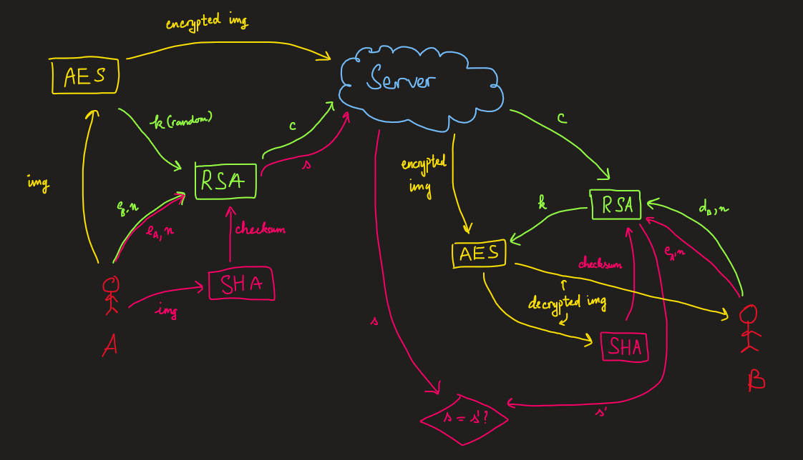

# Simple Image Sharing, But Secured

A project in Introduction to Cryptography - CSC15005

## The protocol
### Upload-download and file checksum:

Note:
* Image encryption: using AES block cipher encryption with CBC mode.

### Key sharing:

## Installation
Client installation, please visit [client/readme.md](client/readme.md)

Server installation, please visit [server/readme.md](server/readme.md)

## Our team
|   SID   |       Name          |     GitHub     |   
|---------|---------------------|----------------|
|19120064 |Nguyen Ho Hoang Duy  |[nhhduy](https://github.com/nhhduy)|
|19120179 |Vo Truong Trung Chanh |[vttchanh](https://github.com/vttchanh)|
|19120266 |Nguyen Hoang Anh Kiet|[NHAK2302](https://github.com/nhak2302)
|19120338 |Tran Hoang Quan|[trhgquan](https://github.com/trhgquan)

VNUHCM - University of Science, Dec. 2021 - Jan. 2022.